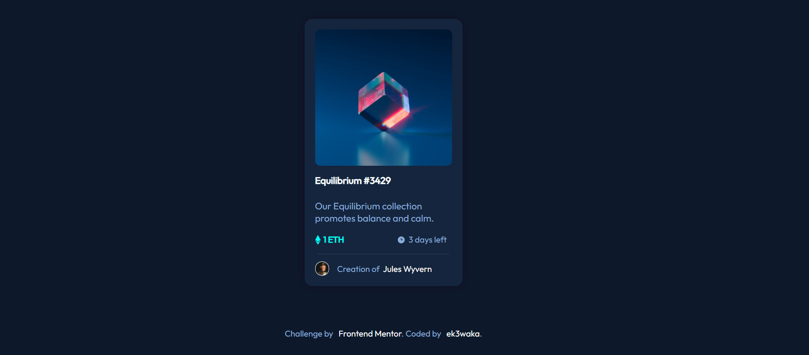

# Frontend Mentor - NFT preview card component solution

This is a solution to the [NFT preview card component challenge on Frontend Mentor](https://www.frontendmentor.io/challenges/nft-preview-card-component-SbdUL_w0U). 

## Table of contents

- [Overview](#overview)
  - [The challenge](#the-challenge)
  - [Screenshot](#screenshot)
  - [Links](#links)
- [My process](#my-process)
  - [Built with](#built-with)
  - [What I learned](#what-i-learned)
  - [Continued development](#continued-development)
  - [Useful resources](#useful-resources)
- [Author](#author)

## Overview

### The challenge

Users should be able to:

- View the optimal layout depending on their device's screen size
- See hover states for interactive elements

### Screenshot

### Links

- Solution URL: [Solution is here](https://ek3waka.github.io/nft-preview-card-component-main)

## My process

### Built with

- Semantic HTML5 markup
- CSS custom properties
- Flexbox

### What I learned

I learned how to use hover effects and ::before selector and started learning @media CSS at-rule

### Continued development

In the future I want to focus on animations and working with js.

### Useful resources

- [w3schools](https://www.w3schools.com/howto/howto_css_image_overlay_icon.asp) - This helped me to do hover effect.
- [Habr](https://habr.com/ru/company/skillbox/blog/592643/) - This is an article which helped me with ::before selector. 

## Author

- Github - [ek3waka](https://github.com/ek3waka)
- Frontend Mentor - [@ek3waka](https://www.frontendmentor.io/profile/ek3waka)
